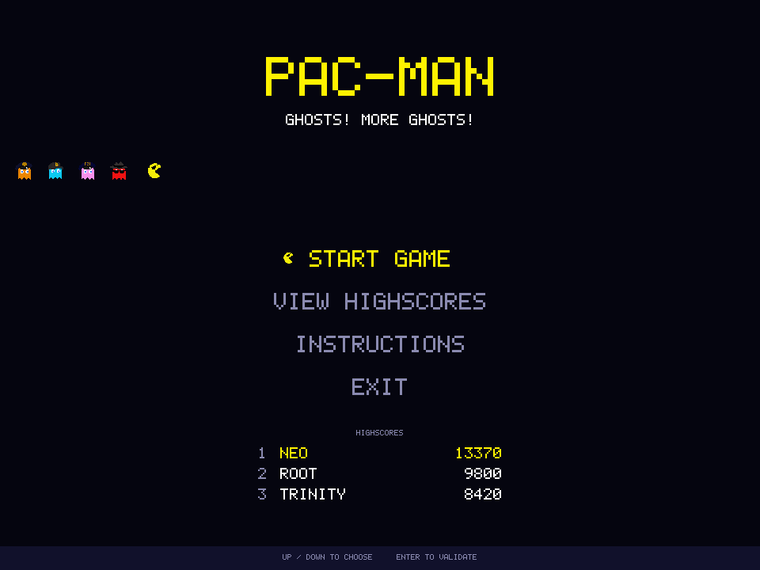
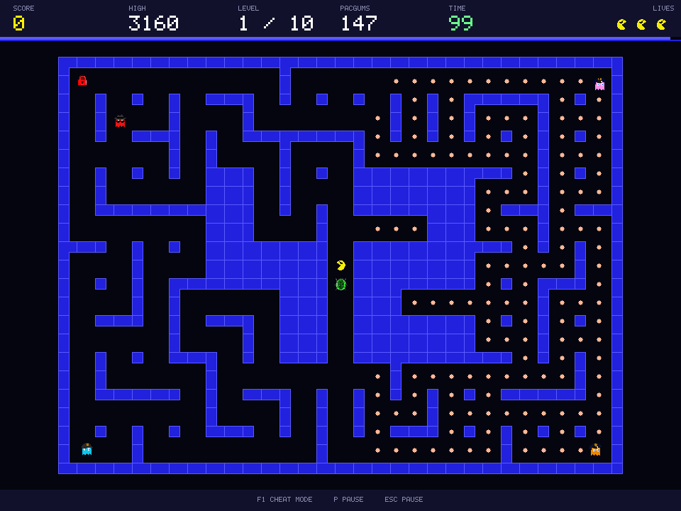
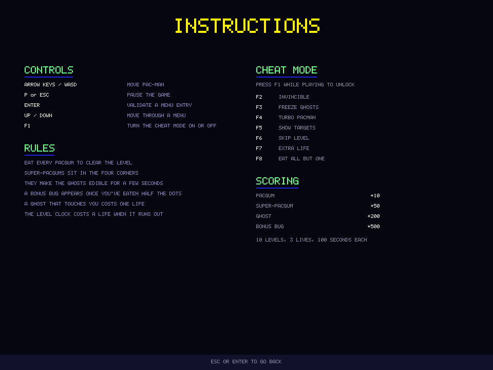
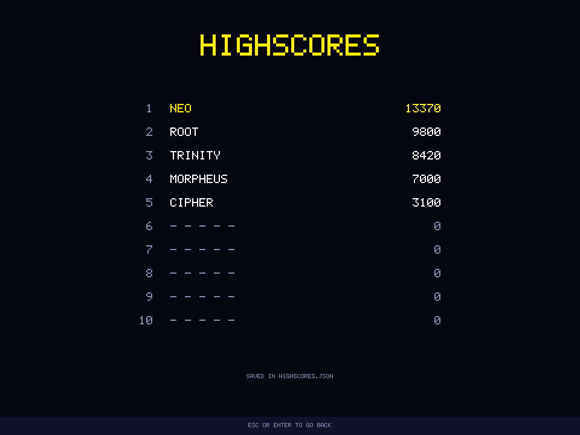

*This project has been created as part of the 42 curriculum by daniviei.*

# Pac-Man — Ghosts! More ghosts!

A complete, playable Pac-Man written in Python, built on top of an
MLX-shaped graphics layer, an external maze generator and a
configuration file that can be rewritten without ever crashing the
game.

```
$> python3 pac-man.py config.json
```

## Description

The goal of the project is to recreate the 1980 arcade game with a
modern, modular structure: object-oriented code, a graphical library
restricted to what MiniLibX offers, mazes produced by another group's
`A-Maze-ing` package, and a build that can be shipped to a public
gaming platform.

You control Pac-Man inside a maze generated at run time. Eat every
pacgum before the clock runs out to reach the next level. Four ghosts
hunt you, each with its own personality; the four super-pacgums, one
per corner, turn the tables for a few seconds. The game runs ten
levels, keeps a persistent top-ten table, and never shows a Python
traceback whatever you feed it.

| | |
| --- | --- |
|  |  |
|  |  |

### Features

* Ten levels of growing size, the first one reproducible from a seed.
* A "Hack the World" theme: a hand-rolled PNG decoder and pixel-perfect
  sprite blitting reskin the whole cast, with the original hand-drawn
  shapes kept as a safety net if the artwork cannot be loaded.
* Four ghosts with the original arcade targeting: **Blinky** chases
  (and speeds up once the maze is nearly clear, arcade-style "Cruise
  Elroy"), **Pinky** cuts corners, **Inky** flanks, **Clyde** panics.
* Super-pacgums, edible ghosts, chained scoring, lives, a level clock
  and a one-shot bonus item, all driven by the configuration file.
* Main menu, in-game HUD, pause menu, game over and victory screens,
  name entry and a persistent top-ten table.
* A cheat mode built for peer review: seven switches that make every
  feature of the game reachable in seconds.
* JSON-with-comments configuration; every faulty value is clamped,
  reported on screen and survived.
* A standalone build produced by `make package`, ready for itch.io.
* `flake8`, `mypy` with the mandatory flags **and** `mypy --strict`
  all clean; 53 unit tests.

## Instructions

### Requirements

* Python **3.10** or later.
* The `A-Maze-ing` package assigned to the group, delivered as a
  `.whl` or a `.zip`. Drop it at the root of the repository.
* `pygame` is recommended but optional: without it the game falls back
  to the `tkinter` backend of the standard library.

### Installation

```bash
python3 -m venv .venv && . .venv/bin/activate   # recommended
make install
```

`make install` installs the Python dependencies and then runs
`install_generator.py`, which finds the assigned A-Maze-ing archive
next to the Makefile, extracts the wheel if it is zipped, and installs
it with pip. To reinstall only that package later:

```bash
make generator
```

### Running

```bash
make run                     # python3 pac-man.py config.json
make run CONFIG=other.json   # another configuration file
python3 pac-man.py config.json
```

The program takes **exactly one argument**: a `.json` configuration
file. Any other invocation prints a usage message and exits without a
traceback.

If `python3` is not on your PATH, override it: `make run PYTHON=python`.

### Make targets

| Target | What it does |
| --- | --- |
| `install` | Install every dependency plus the assigned A-Maze-ing package |
| `generator` | Reinstall only the assigned A-Maze-ing package |
| `run` | Start the game |
| `debug` | Start the game under `pdb` |
| `clean` | Remove `__pycache__`, `.mypy_cache`, `.pytest_cache`, `build`, `dist` |
| `lint` | `flake8 .` and `mypy .` with the mandatory flags |
| `lint-strict` | `flake8 .` and `mypy . --strict` |
| `test` | Run the 53 unit tests |
| `package` | Build the standalone game with PyInstaller |
| `help` | List the targets |

## Controls

| Key | Action |
| --- | --- |
| Arrow keys or `W` `A` `S` `D` | Move Pac-Man |
| `P` or `ESC` | Pause and resume |
| Up / Down | Move through a menu |
| `ENTER` or `SPACE` | Validate |
| `1` … `4` | Pick a main-menu entry directly |
| `F1` | Turn the cheat mode on or off |
| Letters, digits, space, `BACKSPACE` | Type your name on the score screen |

A direction pressed before a junction is remembered and applied as
soon as the corridor opens, exactly like the arcade original.

## Cheat mode

Press `F1` while playing. The footer then lists every switch:

| Key | Cheat | Why a reviewer wants it |
| --- | --- | --- |
| `F2` | Invincibility | Explore a maze without dying |
| `F3` | Freeze the ghosts | Inspect the board, check the spawns |
| `F4` | Faster Pac-Man | Cross a big maze quickly |
| `F5` | Show ghost targets | See the four AIs aiming at different tiles |
| `F6` | Skip the level | Reach level 10 and the victory screen in seconds |
| `F7` | One extra life | Keep testing after a mistake |
| `F8` | Leave a single pacgum | Trigger the end of a level on demand |

Set `"cheat_mode": true` in the configuration to start with the mode
already unlocked.

## Configuration

The file is standard JSON **plus comments**. Lines starting with `#`
are ignored, and `//` line comments, `/* block comments */` and
trailing commas are accepted as well. Comment markers inside a JSON
string stay part of the string.

Every key is optional. A missing, mistyped or out-of-range value is
replaced by a documented default, the reason is printed on the
terminal and shown on a start-up screen, and the game keeps going.
Unknown keys are ignored. There is no configuration that makes the
game crash.

### Keys

| Key | Type | Default | Range | Meaning |
| --- | --- | --- | --- | --- |
| `highscore_filename` | string | `highscores.json` | — | Score file, resolved next to the configuration file |
| `lives` | int | `3` | 1 – 99 | Lives at the start of a game |
| `pacgum` | int | `42` | 0 – 100000 | Pacgums placed in each maze; `0` fills every corridor |
| `points_per_pacgum` | int | `10` | 0 – 100000 | Score for one pacgum |
| `points_per_super_pacgum` | int | `50` | 0 – 100000 | Score for one super-pacgum |
| `points_per_ghost` | int | `200` | 0 – 100000 | Score for one edible ghost |
| `points_per_bonus` | int | `500` | 0 – 100000 | Score for the bonus item (see below) |
| `bonus_duration` | number | `10.0` | 1 – 120 | Seconds the bonus item stays on the board |
| `seed` | int | `42` | 0 – 2³¹-1 | Seed of the **first** maze; `0` means fully random |
| `level_max_time` | number | `90` | 5 – 3600 | Seconds per level, unless a level overrides it |
| `levels` | list | ten built-in levels | — | One object per level, see below |

`level` is accepted as a synonym of `levels`. Each entry understands:

| Key | Type | Default | Range | Meaning |
| --- | --- | --- | --- | --- |
| `width` | int | built-in | 7 – 45 | Maze width **in generator cells** |
| `height` | int | built-in | 7 – 45 | Maze height in generator cells |
| `pacgum` | int | global value | 0 – 100000 | Overrides the global count for this level |
| `max_time` | number | global value | 5 – 3600 | Overrides the global clock for this level |

A maze of `width` × `height` cells becomes a playfield of
`(2·width+1)` × `(2·height+1)` tiles. The game always holds **at least
ten levels**: if the file declares fewer, the list is padded with the
built-in ones.

### Optional tuning

| Key | Type | Default | Meaning |
| --- | --- | --- | --- |
| `player_speed` | number | `6.0` | Player speed, in tiles per second |
| `ghost_speed` | number | `5.0` | Ghost speed on level 1 |
| `ghost_speed_step` | number | `0.15` | Added to the ghost speed per extra level |
| `ghost_frightened_speed` | number | `3.2` | Speed of an edible ghost |
| `super_pacgum_duration` | number | `8.0` | Seconds the ghosts stay edible |
| `ghost_respawn_delay` | number | `6.0` | Seconds before an eaten ghost comes back |
| `scatter_duration` | number | `7.0` | Calm seconds at the start of a level |
| `ghost_score_doubling` | bool | `false` | `true` gives the arcade 200/400/800/1600 chain |
| `timeout_costs_life` | bool | `true` | `false` retries the level for free |
| `cheat_mode` | bool | `false` | `true` starts with the cheats unlocked |
| `highscore_size` | int | `10` | Size of the score table |
| `window_width` / `window_height` | int | `960` / `720` | Window size |
| `target_fps` | int | `60` | Frame rate cap |
| `backend` | string | `auto` | `auto`, `pygame` or `tk` |

The shipped `config.json` is a commented reference of all of them.

### About `pacgum: 0`

The subject asks for pacgums "in most corridors", so the shipped
config uses **`pacgum: 0`**, which fills every open corridor with a
dot -- the classic arcade look. `level_max_time` for each level was
raised accordingly (see the `levels` array), since clearing a fully
dotted maze takes longer than clearing a sparse one.

Setting `pacgum` to a positive number switches to a fixed dot count
instead: the dots are then spread with farthest-point sampling, so
every part of the maze still holds some, but with visibly emptier
corridors and a shorter clock to match.

### Theme: Hack the World

The artwork in `images/` reskins the arcade cast as a hacker story:
Pac-Man is a sunglasses-wearing hacker, and the four ghosts are the
agencies on his trail -- **Blinky** a mafia enforcer, **Pinky** the
FBI, **Inky** federal police, **Clyde** the local police. The four
super-pacgums are a padlock, a floppy disk and a terminal (cycling
across the four corners), and a glowing bug -- `virus.png` -- is the
bonus item described below.

Every themed sprite is decoded from PNG by
[`mlxlib/png.py`](src/pacman/mlxlib/png.py), a small decoder written
against `zlib` and `struct` alone (see
[Graphics](#graphics-a-layer-shaped-like-minilibx)). If `images/` is
missing or a file cannot be decoded, [`ui/skin.py`](src/pacman/ui/skin.py)
falls back to the original hand-drawn shapes in
[`ui/sprites.py`](src/pacman/ui/sprites.py) instead of crashing.

### Bonus item

Once the player has eaten half of a level's dots, a bug (`virus.png`)
appears near the centre of the maze -- the fixed tile closest to the
middle that isn't the player's spawn point, a corner, or already
reserved. It is worth `points_per_bonus` and disappears after
`bonus_duration` seconds if left uneaten. It only appears once per
level.

### Blinky's Cruise Elroy mode

True to the arcade original, Blinky is the fiercest of the four: once
30% or fewer dots remain on the board, he moves 15% faster than his
base speed (`BLINKY_FIERCE_FRACTION` / `BLINKY_FIERCE_BOOST` in
[`game/level.py`](src/pacman/game/level.py)) until the level ends.

## Highscore

The top ten is stored as a small JSON document:

```json
{
  "scores": [
    { "name": "DANIVIEI", "score": 4200 }
  ]
}
```

**Why this design.** A plain JSON file next to the configuration is
the smallest thing that satisfies every requirement of the subject:
it is human-readable, it needs no dependency, it is trivial to inspect
during a peer review, and it is the same format as the configuration
so the project only carries one parser. A database or a remote service
would add a dependency and a failure mode for no gain at this scale.

**How it behaves.**

* Loaded once when the game starts, saved when a game ends.
* Names are limited to **10 characters**, letters, digits and single
  spaces; anything else is dropped as it is typed and again on load.
  An empty name becomes `PLAYER`.
* Scores are non-negative integers, clamped on the way in.
* Only the ten best are kept, sorted by descending score.
* The player is asked for a name after **every** game, win or lose;
  the screen says whether the score makes the table.
* Every failure is survivable: a missing file starts an empty table, a
  corrupted file starts an empty table with a notice, invalid rows are
  skipped and counted.
* Writing is atomic (write to `.tmp`, then `os.replace`), so a crash
  during the save cannot destroy the previous table.
* If the folder is read-only — which happens with a packaged build
  installed system-wide — the table falls back to the per-user data
  directory (`%APPDATA%\pacman42` on Windows, `$XDG_DATA_HOME` or
  `~/.local/share/pacman42` elsewhere) and says so.

## Maze Generation

The mazes come from the `A-Maze-ing` package assigned to the group.
**No maze generator was written for this project**, and the assigned
package is used exactly as delivered — it is installed with pip, never
copied into this repository and never modified.

### The interface it exposes

```python
from mazegenerator import MazeGenerator

generator = MazeGenerator(size=(width, height), perfect=False, seed=42)
cells = generator.maze          # cells[row][column], one int per cell
```

Each cell is a bit field: `1` north wall, `2` east, `4` south, `8`
west. A cell equal to `15` is fully walled — the package uses those to
carve a **42** inside every maze.

`perfect=False` is passed as the subject demands: an imperfect maze
has loops, so a chased player is never trapped in a dead end.

### Adapting to their interface, not the opposite

`src/pacman/game/generator.py` is the only file that knows the package
exists. It inspects the constructor with `inspect.signature` and only
passes the arguments it actually accepts — `size=(w, h)` if that is
what it wants, `width=` and `height=` otherwise — then looks for the
grid under `maze`, `grid`, `cells`, `get_maze` or `get_grid`, calling
it if it is a method. If the assigned package is reinstalled during
the peer review with a slightly different signature, the loader
adapts; nothing else in the game changes.

Every failure is converted into a `GeneratorError` carrying a readable
message: the package missing, an exception during generation, a grid
of non-integers, an unusable maze. The session retries with a random
seed and, if that fails too, shows an on-screen error instead of
crashing.

### From cells to a Pac-Man playfield

A maze of `w × h` cells becomes a tile grid of `(2w+1) × (2h+1)`:

```
cell (x, y)              ->  tile (2x+1, 2y+1)      always a corridor
wall between two cells   ->  the tile between them  corridor if open
everything else          ->  wall
```

Three rules make the result playable:

1. **A passage is carved only when both cells agree.** Cell A having no
   east wall is not enough; cell B must also have no west wall. This
   matters because the package adds walls around the `42` pattern after
   carving, which can leave one-sided openings.
2. **Cells equal to `15` become solid walls.** They are the `42`
   pattern, and drawing them as walls is what makes the number visible
   in the middle of the maze.
3. **Only the largest connected area is kept.** The `42` pattern leaves
   small pockets that nothing can reach; every corridor outside the main
   area is turned back into a wall, so no pacgum can ever be
   unreachable.

Spawn points are then derived from the tile grid: the player starts on
the corridor closest to the centre, and the four ghosts and the four
super-pacgums take the corridors closest to the four corners.

### Seeds

The first level uses the `seed` from the configuration, so it is
reproducible; every later level asks the package for `seed = 0`, which
is how it spells "fully random". The pacgum layout uses a separate
random source, so it never disturbs the generator's own.

## Implementation

### Graphics: a layer shaped like MiniLibX

The subject only allows a graphical library if **every function used
has an equivalent in MiniLibX**. Rather than trusting a per-call
review, the constraint is enforced by the architecture: the whole game
draws through `pacman.mlxlib`, which exposes nothing else than the
MiniLibX surface.

| `pacman.mlxlib` | MiniLibX |
| --- | --- |
| `Mlx()` | `mlx_init` |
| `Mlx.new_window` | `mlx_new_window` |
| `Mlx.new_image` | `mlx_new_image` |
| `Image.data` | `mlx_get_data_addr` |
| `Image.pixel_put` | `mlx_pixel_put` |
| `Mlx.put_image_to_window` | `mlx_put_image_to_window` |
| `Mlx.string_put` | `mlx_string_put` |
| `Mlx.clear_window` | `mlx_clear_window` |
| `Mlx.hook` / `Mlx.key_hook` | `mlx_hook` / `mlx_key_hook` |
| `Mlx.loop_hook` | `mlx_loop_hook` |
| `Mlx.loop` / `Mlx.loop_end` | `mlx_loop` / `mlx_loop_end` |
| `Mlx.destroy_image` | `mlx_destroy_image` |
| `Mlx.destroy_window` | `mlx_destroy_window` |
| `mlxlib.png.decode` | `mlx_png_file_to_image` / `mlx_texture_to_image` (MLX42) |

Under that facade sits one of two interchangeable backends, each
reduced to four operations — open a window, push a whole image to it,
read key events, close the window:

| Backend | Open window | Push image | Events | Close |
| --- | --- | --- | --- | --- |
| pygame | `display.set_mode` | `image.frombuffer` + `blit` + `flip` | `event.get` | `display.quit` |
| tkinter | `Canvas` in a `Tk` | `PhotoImage` + `create_image` | `bind` | `destroy` |

Everything else is our own code writing bytes into a `bytearray`:
rectangles, discs, the wall blocks, and a **5×7 bitmap font** drawn
glyph by glyph — exactly what a 42 student layers on top of
`mlx_pixel_put` in C. No `pygame.draw`, no `pygame.font`, no canvas
item: none of them has a MiniLibX equivalent.

The "hack the world" artwork works the same way. MLX42 (and some MLX
forks) can decode a PNG file into pixels but, like `mlx_pixel_put`,
offers no primitive to composite one image onto another — a student
does that by hand, reading the source pixels and writing them one by
one, respecting alpha. That is exactly what happens here:
[`mlxlib/png.py`](src/pacman/mlxlib/png.py) decodes a PNG with nothing
but `zlib` and `struct` (inflating the IDAT stream and reversing the
five PNG scanline filters itself), and
[`ui/assets.py`](src/pacman/ui/assets.py) stamps the result onto the
frame buffer pixel by pixel -- nearest-neighbour scaled, optionally
mirrored or rotated in 90° steps, alpha-blended with the same
`pixel_put`-style writes as everything else.
[`ui/skin.py`](src/pacman/ui/skin.py) maps each themed sprite (the
player, the four ghosts, their frightened and eaten states, the
corner icons, the bonus item) onto the matching shape in
`ui/sprites.py`, and falls back to that hand-drawn shape whenever a
file is missing or fails to decode -- the theme is cosmetic, never a
crash risk.

Key codes are X11 keysyms, the values MiniLibX hands to its hooks;
each backend translates its native codes into those.

### Movement

Bodies live at floating point tile coordinates but may only travel
from one tile centre to the next. A `Mover` keeps the tile it left and
the tile it is entering; it only decides where to go when it is
exactly on a centre. That single rule gives grid-locked, arcade-like
movement, makes walls impossible to clip through, and makes a turn
pressed early simply wait until the corridor opens.

### Ghosts

Each ghost has a **target tile** and, at every tile centre, takes the
exit that minimises the straight-line distance to it, never turning
back — the original arcade rule. Only the target differs:

| Ghost | Target |
| --- | --- |
| Blinky | The player's tile |
| Pinky | Four tiles in front of the player |
| Inky | The point symmetric to Blinky through two tiles in front of the player |
| Clyde | The player, until he gets within eight tiles, then his own corner |

A level opens with a few calm seconds during which every ghost heads
for its corner. Eating a super-pacgum flips the rule: frightened
ghosts reverse and then take the exit that *maximises* the distance to
the player. An eaten ghost returns to its corner as a pair of eyes and
comes back after `ghost_respawn_delay` seconds.

### Rendering

The maze never changes during a level, so its walls are painted once
into a background image. Each frame copies that buffer in one
`bytearray` slice assignment and only redraws what moves: the dots,
the four ghosts, Pac-Man and the HUD. Filled rectangles are written
one row at a time with a slice assignment, which keeps the whole frame
well inside a 60 Hz budget even in pure Python.

### Robustness

No code path is allowed to reach the user as a traceback. The command
line, the configuration reader, the highscore file, the maze generator
and the graphics backend all convert their failures into messages,
either on the terminal or on a dedicated screen, and the game either
continues on safe defaults or exits cleanly with a non-zero status.

## General Software Architecture

Four layers, each depending only on the ones above it. The game logic
never touches a pixel; the drawing code never decides a rule.

```
pac-man.py                      launcher, adds src/ to sys.path
└── pacman.main                 argument handling, exit codes
    └── pacman.app              screens, input routing, main loop
        ├── pacman.settings     Config, LevelSpec, validation, clamping
        │   └── pacman.jsonc    JSON with comments
        ├── pacman.highscore    Highscores, Entry, persistence
        ├── pacman.game         pure logic, no I/O
        │   ├── direction       Direction, the four cardinal steps
        │   ├── maze            Maze, cell grid -> tile grid
        │   ├── generator       adapter over the A-Maze-ing package
        │   ├── entities        Mover, Player
        │   ├── ghosts          Ghost, GhostKind, GhostState
        │   ├── level           Level, LevelEvents, dot placement
        │   ├── session         Session, lives, score, level ladder
        │   └── cheats          Cheats
        ├── pacman.ui           state -> pixels
        │   ├── theme           colours and layout constants
        │   ├── sprites         Pac-Man, ghosts, dots (hand-drawn shapes)
        │   ├── assets          Sheet, PNG loading and blitting
        │   ├── skin            themed sprites, falls back to sprites
        │   ├── render          Renderer, Layout, wall cache
        │   └── screens         menus, HUD, overlays
        └── pacman.mlxlib       MLX-shaped graphics layer
            ├── image           Image, the pixel buffer
            ├── png             PNG decoder (zlib + struct only)
            ├── font            5x7 bitmap font
            ├── keys            X11 keysyms
            ├── mlx             Mlx, the facade
            └── backends        pygame, tkinter
```

### Main classes

| Class | Responsibility |
| --- | --- |
| `Mlx` | The MiniLibX surface: window, images, hooks, loop |
| `Image` | A writable RGB buffer with pixel, rectangle and disc writes |
| `Config` / `LevelSpec` | Immutable, already validated settings |
| `Maze` | Tile grid, walkability, spawn points |
| `Mover` → `Player`, `Ghost` | Grid-locked bodies; ghosts add a target and a state machine |
| `Level` | One maze, its dots, its clock; returns `LevelEvents` |
| `Session` | Score, lives, the ladder of levels, win and lose |
| `Cheats` | The seven review switches |
| `Highscores` | The persistent top ten |
| `Sheet` | A decoded PNG, blitted scaled/mirrored/rotated onto an `Image` |
| `Renderer` | Frame buffer, layout, wall cache |
| `Application` | The screen state machine and the input routing |

### Data flow of one frame

```
key event ──> Application.on_key ──> Player.steer / menu / cheat
                                              │
Mlx.loop ──> Application.on_frame(dt) ──> Session.update(dt)
                                              │      └─> Level.update ─> LevelEvents
                                              │             ├─ Player.update
                                              │             ├─ Ghost.aim + update
                                              │             └─ eat / collide / clock
                                              └─> Renderer.draw_level + screens
                                                        └─> Mlx.put_image_to_window
```

### Tests

`make test` runs 53 unit tests over the four logic modules. They open
no window, which is the direct benefit of keeping the game logic free
of any drawing code. `tools/measure_balance.py` goes further and plays
every level with an optimal bot to check that the clocks are fair.

## Packaging

```bash
make package        # -> dist/pacman/
```

PyInstaller produces a self-contained folder holding the executable,
the interpreter, `config.json`, `INSTRUCTIONS.txt` and the `images/`
artwork. It runs on a machine without Python. Launched without an
argument it loads the bundled configuration; launched with one it
loads that file instead.

The specification (`pacman.spec`) and the build script (`package.py`)
are both at the root of the repository, so the build can be
regenerated during the peer review. The publishing steps for itch.io
(with `butler`) and Steam are in
[packaging/README.md](packaging/README.md).

## Project Management

The project ran as five short iterations, each ending on a playable
build, with a Kanban board capped at three items in progress. The
evidence — requirement analysis, planned versus actual timeline, the
board, the risk register, the acceptance test plan with its results
and bug list, and the retrospective — is in
[project_management/](project_management/README.md).

Summary: 38 requirements extracted from the subject, 31 cards (29
done, 2 deliberately dropped), one iteration a day late because the
movement model had to be rewritten, absorbed by cutting two cosmetic
features. Details in
[project_management/02-timeline.md](project_management/02-timeline.md)
and
[project_management/07-retrospective.md](project_management/07-retrospective.md).

## Resources

### On Pac-Man

* Jamey Pittman, *The Pac-Man Dossier* — the reference on ghost
  targeting, speeds and level tables:
  <https://pacman.holenet.info/>
* Chad Birch, *Understanding Pac-Man Ghost Behavior* —
  <https://gameinternals.com/understanding-pac-man-ghost-behavior>
* Toru Iwatani's design interviews, on the origin of the four
  personalities.

### On the techniques used

* MiniLibX documentation and the 42 `mlx_*` man pages, used as the
  reference for the API this project mirrors.
* Amit Patel, *Red Blob Games* — grid movement and pathfinding:
  <https://www.redblobgames.com/>
* *Maze generation algorithms*, Jamis Buck — background on perfect
  versus braided mazes:
  <https://weblog.jamisbuck.org/2011/2/7/maze-generation-algorithm-recap>
* PEP 8, PEP 257 and PEP 484 for style, docstrings and type hints.
* `flake8`, `mypy` and `pytest` documentation.
* PyInstaller documentation and the itch.io `butler` guide.

### Use of AI

An AI assistant was used throughout this project, as the subject
encourages. Concretely, it helped with:

* **Reading the subject.** Cross-reading the chapters to list every
  requirement and to surface the ambiguities that had to be settled
  before coding — notably `pacgum: 42` against "pacgums in most
  corridors", and what "similar to MLX" actually excludes. The
  decisions and their reasons are in
  [project_management/01-analysis.md](project_management/01-analysis.md).
* **Discussing the architecture.** Comparing the options for the
  graphics layer against the "every function must have an MLX
  equivalent" rule, and for the tile-to-tile movement model.
* **Writing code.** Drafting modules, the 5x7 bitmap font table, the
  docstrings, and the configuration reference tables of this README.
* **Reviewing.** Critiquing the ghost state machine, which is how the
  reversal bug that made ghosts oscillate at junctions was found.
* **Tests and measurement.** Drafting the unit tests, and the bot in
  `tools/measure_balance.py` used to check that every level clock is
  actually beatable.
* **The "Hack the World" theme.** Writing the PNG decoder in
  `mlxlib/png.py` (zlib + struct only, no Pillow, to keep the "MLX
  equivalents only" rule) and the sprite-blitting pipeline in
  `ui/assets.py` / `ui/skin.py`; mapping the supplied artwork onto the
  player, ghosts, corner icons and the new bonus item, with the
  original hand-drawn shapes kept as a fallback; adding Blinky's
  Cruise Elroy speed-up; and switching `pacgum` to `0` (fill every
  corridor) to match "pacgums in most corridors", retiming
  `level_max_time` for the fuller boards this produces.

Everything produced this way was read, run, tested and corrected.
Several unit tests were wrong on the first attempt because the wall
bits were used the wrong way round; the movement model had to be
thrown away and rewritten. Nothing was kept in this repository that
cannot be explained and defended line by line.
